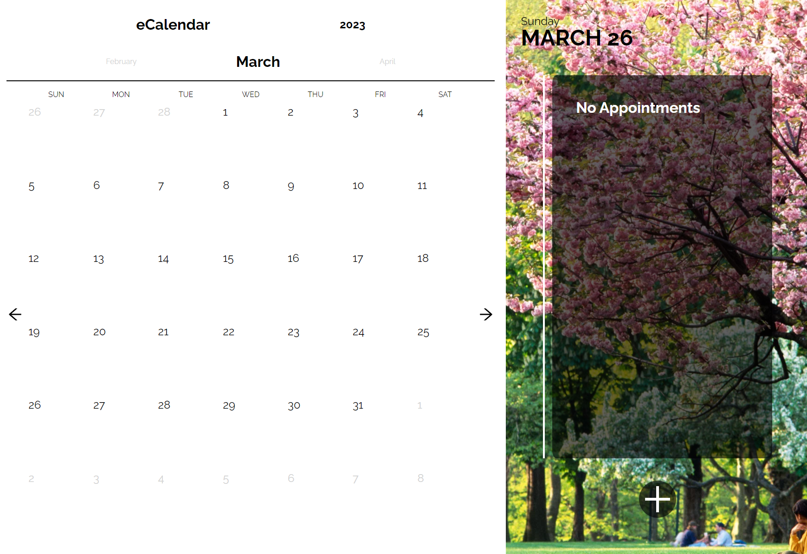

# eCalendar
A simple clickable calendar front-end prototype for managing appointments and important events.

Check out the live demo [here](https://sherlineau.github.io/eCalendar/).

##### Utilized Libraries & Dependencies
- React
- React Icons

Important notes:
Submitting the form modal does nothing at the moment, further development can be done to set up a backend to save and handle form data.

#### Installation
1. clone or fork the repo
  ```git clone https://github.com/sherlineau/eCalendar```
2. using your terminal, change directory into the new project folder
3. run ```npm i ``` to install project dependencies
4. start the project using ```npm start```





